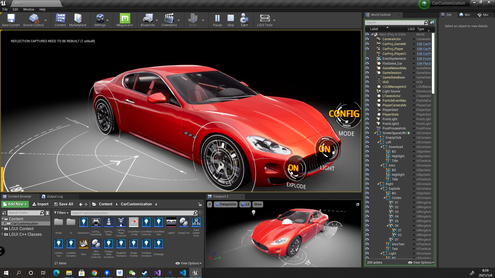

# LGUI-Sample--CarCustomization
 a car customization sample project for LGUI. LGUI is a component based 3D UI framework for UE4.

This project using UE4.24 and LGUI 2.10.0

Check video:

https://youtu.be/IUndFBMiUNQ

https://www.bilibili.com/video/BV1fh41117dL/
